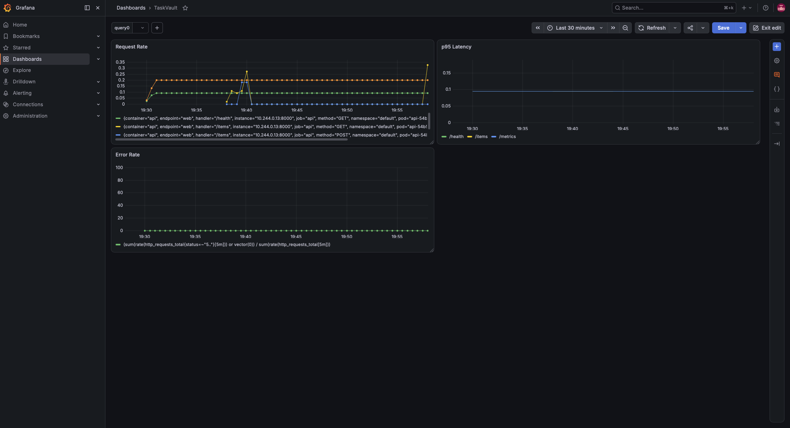

# Project Sentinel

Story-driven learning project: Docker → Docker Compose → Prometheus → Kubernetes → Prometheus/Grafana in-cluster.
Personal notes repo — documents what was built, in what order, and every real bug hit along the way
(not just the happy path). Written for future-me to re-read and remember *why*, not just *what*.

## The story

Vedant, junior backend engineer, joins startup **Northbeam**. First assignment:
**TaskVault**, internal notes/task API used by the whole team. Problem —

- Runs as a bare `uvicorn` process on someone's old laptop-turned-server.
- Crashes overnight, nobody notices till morning standup.
- No metrics, no dashboards, no idea why it dies or how loaded it is.
- Restarts are manual: SSH in, `kill`, `nohup python main.py &`, pray.

Vedant's mission, given by his lead:

> "Make it survive. Make it visible. I don't want to hear about downtime
> from a Slack message anymore — I want to see it coming."

That's the whole tech stack in one sentence:
- **Docker** — package TaskVault so it runs the same everywhere.
- **Kubernetes** — orchestration layer that restarts it when it dies, scales it, rolls out updates safely.
- **Prometheus + Grafana** — visibility: know load, latency, error rate, and get alerted before users do.

## Chapters — status

1. ✅ **Containerize TaskVault** — Docker image, run standalone.
2. ✅ **docker-compose** — TaskVault + Postgres together, local dev loop.
3. ✅ **Instrument** — `/metrics` endpoint, first Prometheus concepts, standalone Prometheus container scraping it.
4. ✅ **Kubernetes** — kind cluster, Deployment + Service, self-healing, PersistentVolumeClaim, Secrets.
5. ✅ **Prometheus + Grafana in-cluster** — Helm, `ServiceMonitor`, first Grafana dashboard.
6. ✅ **PromQL + real dashboard** — request rate, p95 latency, error rate panels (RED method). Folded
   into Chapter 5 in practice — building the dashboard *was* the PromQL depth.
7. ⬜ *(advanced)* Chaos — kill pods, watch self-heal, build alerts (Alertmanager).
8. ⬜ *(advanced)* Autoscaling (HPA), Ingress, Loki logs.

**Deferred, noted for later:** proper secrets management (Sealed Secrets or Vault OSS) — see
[What to learn next](#what-to-learn-next) at the bottom.

## Rules for this project (how we're doing this)

- Application/Python code — Claude writes directly.
- Docker / Kubernetes / monitoring config files — **Vedant types every line himself**, Claude gives
  line-by-line or block-by-block code with explanation. Never auto-written.
- Docker / Kubernetes / stack commands — Claude gives the exact command, Vedant runs it in his own
  terminal and pastes the output back. Claude does not execute these directly.
- Goal: understand every line, not just have it work.

## Stack

- Python 3.12, FastAPI, SQLAlchemy, Postgres 17
- `prometheus-fastapi-instrumentator` for `/metrics`
- Docker, Docker Compose
- Kubernetes via `kind` (Kubernetes-in-Docker), `kubectl`
- Prometheus (standalone in Compose for Ch.3; in-cluster via Helm from Ch.5 on)
- Helm — `kube-prometheus-stack` chart (Prometheus + Grafana + Alertmanager + node-exporter +
  kube-state-metrics + Prometheus Operator/CRDs)

## Run it — Docker Compose (Chapters 1-3)

```
docker compose up --build
```

- API: http://localhost:8000, docs at `/docs`
- Metrics: http://localhost:8000/metrics
- Prometheus UI: http://localhost:9090

## Run it — Kubernetes (Chapter 4)

```
kind create cluster --name sentinel
kind load docker-image prooo-api:latest --name sentinel

kubectl apply -f k8s/postgres-secret.yaml
kubectl apply -f k8s/postgres-pvc.yaml
kubectl apply -f k8s/postgres-deployment.yaml
kubectl apply -f k8s/postgres-service.yaml
kubectl apply -f k8s/api-deployment.yaml
kubectl apply -f k8s/api-service.yaml

kubectl port-forward svc/api 8000:8000
```

Then `curl http://localhost:8000/items` in another terminal.

If you rebuild the app image (`docker compose build api` or `docker build .`), you must
re-`kind load docker-image` and `kubectl rollout restart deployment/api` — kind's node doesn't
see new local images automatically.

## Run it — Prometheus + Grafana in-cluster (Chapter 5)

```
helm repo add prometheus-community https://prometheus-community.github.io/helm-charts
helm repo update

kubectl create namespace monitoring
helm install monitoring prometheus-community/kube-prometheus-stack --namespace monitoring

kubectl apply -f k8s/api-service.yaml
kubectl apply -f k8s/api-servicemonitor.yaml

kubectl --namespace monitoring port-forward svc/monitoring-grafana 3000:80
```

- Grafana: http://localhost:3000, user `admin`, password:
  `kubectl --namespace monitoring get secrets monitoring-grafana -o jsonpath="{.data.admin-password}" | base64 -d; echo`
- Prometheus UI (optional, for raw PromQL): `kubectl --namespace monitoring port-forward svc/monitoring-kube-prometheus-prometheus 9090:9090`
- Dashboard saved in Grafana as **TaskVault** — Request Rate, p95 Latency, Error Rate panels.

---

## Journal — what we built, stage by stage

### Chapter 1 — Containerize

Built the FastAPI + SQLAlchemy app (`app/`) — `/health`, `/items` CRUD, Postgres via
`DATABASE_URL` env var (12-factor style, no hardcoded connection string).

Typed `Dockerfile` by hand: `FROM python:3.12-slim`, `WORKDIR`, `COPY requirements.txt` before
`COPY app` (layer caching — dependencies rarely change, code changes constantly, so put the
stable layer first), `RUN pip install`, `EXPOSE 8000`, `CMD ["uvicorn", ...]` (exec form, not
shell form — matters for signal handling/PID 1).

**Bugs hit while typing:**
- Typo `FROM oython:3.12-slim` instead of `python:3.12-slim` — caught by reading file back.
- Skipped `COPY requirements.txt .` entirely — would've failed the `pip install` step at build
  time since the file wouldn't exist yet in the build context. Caught same way.

**Real bug, not a typo — networking lesson:** ran the app container standalone
(`docker run -p 8000:8000 sentinel-taskvault:ch1`) with no network setup. Got
`psycopg2.OperationalError: connection to server at "localhost" ... Connection refused`.
Lesson: containers are network-isolated by default — `localhost` *inside* the container is the
container itself, not the host, and not another container. Fixed by creating a user-defined
Docker network (`docker network create sentinel-net`), running Postgres attached to it, and
running the app attached to the same network with `DATABASE_URL` pointing at the Postgres
container's *name* (Docker's internal DNS resolves container names on user-defined networks —
the default bridge network doesn't do this).

### Chapter 2 — docker-compose

Formalized the manual network + two-`docker run` dance into one `docker-compose.yml`: `db`
service (postgres:17, env vars, named volume `pgdata` for persistence) + `api` service
(`build: .`, `DATABASE_URL` pointing at hostname `db` — Compose gives every service a DNS name
automatically, same trick as the manual network, now free).

**Real bug — startup race condition:** first `docker compose up --build` crashed `api` with the
exact same `Connection refused` error, even though `depends_on: [db]` was set. Root cause:
Postgres's first-boot sequence does an internal restart (`initdb` → brief self-check boot →
shutdown → real startup) — `depends_on` only waits for the *container* to start, not for
Postgres *inside* it to actually be ready. `api` launched during that shutdown window and
crashed before its DB connection succeeded (app does `Base.metadata.create_all()` synchronously
at import time — no retry, hard fail).

Fixed properly (not just adding a restart policy) with a `healthcheck` on `db`
(`pg_isready -U sentinel`, checked every 2s) and upgrading `api`'s `depends_on` to
`condition: service_healthy` — `api` now waits for Postgres to be *actually* accepting
connections, not just for the container process to exist.

Verified persistence: added a task, `docker compose down` (removes containers) +
`docker compose up` again (no `--build`), task still there — proved the named volume `pgdata`
decouples data lifetime from container lifetime.

### Chapter 3 — Instrument (`/metrics`) + standalone Prometheus

Wired `prometheus_fastapi_instrumentator` into `main.py` — two lines
(`Instrumentator().instrument(app).expose(app)`) add a `GET /metrics` endpoint exposing counters
(`http_requests_total`), gauges (`process_resident_memory_bytes`), and histograms
(`http_request_duration_seconds_bucket`) in Prometheus's text format.

Learned the two ways Prometheus gets data from a system:
1. **Client library in your own code** (what we just did) — cheap, in-process, exposes `/metrics`
   on demand, Prometheus pulls (scrapes) it on a schedule. App never talks to Prometheus directly.
2. **Exporter** — for code you don't own (Postgres, Nginx, the OS itself). A separate sidecar
   process reads that system's *existing* native stats (e.g. `pg_stat_database`, `/proc`) and
   re-publishes them as `/metrics`, with zero changes to the original software.

Added a real Prometheus server as a `prometheus` service in `docker-compose.yml`
(`prom/prometheus` image, bind-mounted `prometheus.yml` config with a `scrape_configs` job
pointing at `api:8000`). Deliberately no `depends_on` here — Prometheus's scrape loop tolerates a
temporarily-missing target and self-heals on its own every `scrape_interval`, unlike our app's
one-shot startup DB dependency from Chapter 2.

**Bugs hit:**
- Created `prometheus.yml` with a trailing space in the *filename itself*
  (`"prometheus.yml "`) — editor artifact. `ls` found it via pattern match but exact-path tools
  couldn't open it. Fixed with `mv "prometheus.yml " prometheus.yml`.
- First PromQL query in the Prometheus UI: typo `http_reqeusts_total` (letters swapped) — silent
  "no data" instead of an error, since it's just a nonexistent metric name, not invalid syntax.
- Later, a real query returned nothing because Prometheus's graph UI had a stale `End time`
  pinned from an earlier zoom/pan — newer scrapes existed but weren't rendered. Not a data
  problem, a UI-state gotcha.

Confirmed the scrape loop live: watched `http_requests_total{handler="/metrics"}` climb on its
own every 5s in the Prometheus UI — Prometheus counting its own scrapes, since the instrumentator
counts every request including hits to `/metrics` itself.

### Chapter 4 — Kubernetes

Chose `kind` over `minikube` — runs cluster nodes as plain Docker containers (vs a VM), needs
nothing beyond Docker itself already installed, faster spin-up/teardown, and loading locally-built
images is a direct one-command hop (`kind load docker-image`) instead of crossing a VM boundary.

Installed `kind` via Homebrew (`kubectl` was already present, bundled with Docker Desktop, left
as-is — recent enough, not Homebrew-managed so `brew upgrade` doesn't apply to it).

Created cluster: `kind create cluster --name sentinel` — spins up `sentinel-control-plane` as a
literal Docker container, auto-points `kubectl`'s context at it.

Built manifests in `k8s/`, one concept at a time:
- **Deployment** — declares "run N replicas of this container, keep them alive." Internally two
  parts: `selector` (a live query — "which existing pods are mine, by label") and `template` (a
  stamp — "what a new pod should look like if I need one"). The separation is *why* self-healing
  works: Deployment doesn't hold pod references, it re-queries by label constantly and creates
  replacements when the count comes up short.
- **Service** — stable DNS name + load-balancing in front of a Deployment's pods. Necessary
  because pods are disposable and get a new IP every time they're recreated; the Service is the
  one thing that stays constant.
- Custom image (`prooo-api:latest`) needed an explicit `kind load docker-image` step first — the
  `kind` node's container runtime can't see images sitting in regular Docker Desktop. Public
  images (`postgres:17`) pull directly from Docker Hub, no load step needed.
- `imagePullPolicy: IfNotPresent` required on the app's Deployment — otherwise Kubernetes tries
  to pull `prooo-api:latest` from a real registry by default and fails, since it was never pushed
  anywhere, only side-loaded.
- `livenessProbe` hitting `/health` (the endpoint built all the way back in Chapter 1, originally
  just for manual `curl` testing) — first *real* self-healing mechanism: kubelet kills and
  replaces a container that's running but broken, separate from the Deployment's pod-count healing.

**Bugs hit typing `postgres-deployment.yaml`:**
- Duplicated the entire `selector`/`template.metadata` block by accident (typed it twice) — caught
  by reading the file back, fixed by deleting the second copy.
- `env:` was indented as a sibling of `containers:` instead of nested inside the container item
  (under `image`/`ports`) — meant it wasn't actually attached to any container. Fixed by
  re-indenting one level deeper.

**Self-healing demo, done twice, second time revealing a real bug:**
1. `kubectl delete pod postgres-...` — pod replaced automatically within ~2s (new
   name/suffix, `AGE` reset), proving the Deployment's reconciliation loop. The `postgres`
   *Service*'s `CLUSTER-IP` and `AGE` stayed completely untouched throughout — proof Service
   identity is independent of pod identity.
2. Tried to `curl /items` through the new pod (via `kubectl port-forward svc/api 8000:8000`) —
   got `Internal Server Error`. `kubectl logs deployment/api` showed
   `psycopg2.errors.UndefinedTable: relation "tasks" does not exist`. Root cause: the Postgres
   Deployment had **no persistent storage** — deleting the pod destroyed its data along with it
   (fresh ephemeral container filesystem on recreate), and `api` never re-ran
   `Base.metadata.create_all()` since *it* never restarted. Self-healing brought the *process*
   back but not the *data* — exactly the gap `PersistentVolumeClaim` exists to close.

**Fix — PersistentVolumeClaim:** added `k8s/postgres-pvc.yaml` (1Gi, `ReadWriteOnce`, backed by
`kind`'s auto-installed default `StorageClass`), wired it into the Postgres Deployment via
`volumeMounts` (in the container) + `volumes` (at the pod level, referencing the PVC by
`claimName`). Re-ran the whole test: `kubectl rollout restart deployment/api` (forces a fresh
`api` pod even with an unchanged spec, to re-run `create_all()`), added a task, deleted the
`postgres` pod again — this time the task survived the pod's death. PVC identity, like Service
identity, is independent of pod identity — same architectural pattern applied to storage instead
of networking.

**Secrets:** moved `POSTGRES_USER`/`POSTGRES_PASSWORD`/`POSTGRES_DB`/`DATABASE_URL` out of plain
`value:` fields in the Deployments and into a `Secret` object (`k8s/postgres-secret.yaml`,
`stringData` for typing convenience — Kubernetes base64-encodes it on store), referenced from
both Deployments via `valueFrom.secretKeyRef`. Learned base64 is *encoding* not *encryption* —
trivially reversible, no key involved — so this is a real improvement (credentials out of the
Deployment file, `kubectl get secret` hides values by default, can be RBAC-locked) but not
actual security by itself.

**Bug/gotcha found immediately after:** `kubectl get secret postgres-secret -o yaml` showed the
*plaintext* values sitting in `metadata.annotations.kubectl.kubernetes.io/last-applied-configuration`
— not the real `data:` field (that one was correctly base64-only), but a side effect of
`kubectl apply` itself, which stashes a full copy of whatever you sent it (for future diffing) into
that annotation regardless of resource type. Real production gotcha, not specific to this project —
mitigated by using `kubectl create`/`kubectl replace` for Secrets instead of `apply`, or by never
hand-authoring Secret YAML with real credentials in the first place (see below).

### Chapter 5 — Prometheus + Grafana in-cluster (Helm) + real dashboard

Replaced the Chapter 3 standalone Compose Prometheus with the real, production-shaped pattern:
monitoring installed *inside* the cluster it's watching, via Helm.

**Helm** — package manager for Kubernetes. Installs a whole bundle of related resources
(Deployments, Services, Secrets, CRDs...) as one versioned "release" instead of hand-writing YAML
for each piece — the thing Chapters 1-4 did manually for two services would be dozens of files at
real scale. `helm repo add`/`helm repo update` register and refresh a chart source (global config,
not tied to the project directory — unlike `git`). `helm install monitoring
prometheus-community/kube-prometheus-stack --namespace monitoring` pulled down Prometheus,
Grafana, Alertmanager, node-exporter, kube-state-metrics, and the Prometheus Operator — all
pre-wired together — in one command.

**Namespaces vs labels, reinforced:** put the whole monitoring stack in its own `monitoring`
namespace (partition of the cluster, own default scope for `kubectl get`) to keep it separate from
`api`/`postgres` in `default`. Filtering `kubectl get pods -l "release=monitoring"` initially
*missed* the Grafana pod — turned out Grafana's subchart tags its pod with a slightly different
label set than the top-level release label, not a real problem, just a reminder that label
filters are exact-match and chart-dependent.

**Wiring TaskVault in — `ServiceMonitor`:** a CRD (Custom Resource Definition) added by the
Prometheus Operator, not built into core Kubernetes. It tells the Operator "watch this Service,
scrape it," replacing Chapter 3's hand-edited `prometheus.yml`/`scrape_configs` entirely — add a
label, apply a small YAML file, Prometheus finds it automatically from then on. Two things had to
line up for it to work:
- `k8s/api-service.yaml` needed `metadata.labels: app: api` (the *Service object's own* labels —
  separate from `spec.selector`, which picks pods, not the Service itself) and a **named** port
  (`name: web`) — `ServiceMonitor` references ports by name, not number.
- `k8s/api-servicemonitor.yaml` needed `metadata.labels: release: monitoring` — kube-prometheus-stack's
  Prometheus, by default, only picks up `ServiceMonitor`s carrying that exact label (matching the
  Helm release name). Miss it, Prometheus silently ignores the file — no error, just never shows
  up as a scrape target.

**Bug hit typing `api-servicemonitor.yaml`:** `spec:` kept landing indented under `metadata:`
instead of flush-left as its own top-level key — three passes to get it out. A `kind:` block whose
`spec` accidentally nests under `metadata` doesn't error at the YAML level, it just silently drops
the real `spec` and the resource does nothing useful. Caught each time by reading the file back.

Confirmed the wiring end-to-end at `/targets` in the Prometheus UI — `default/api-servicemonitor`
showed `1/1 up`. (Also saw several *other* targets down — `kube-controller-manager`, `kube-etcd`,
`kube-proxy`, `kube-scheduler` — a known `kind`-specific gotcha: the chart's default ServiceMonitors
expect control-plane components exposed the way real clusters expose them, which `kind`'s
control-plane pods don't match. Unrelated to TaskVault, safe to ignore for this project.)

**Grafana + first real dashboard:** port-forwarded `svc/monitoring-grafana` (a *Service*, same
pattern as `api` in Chapter 4), logged in with the admin password pulled from Grafana's own
auto-generated Secret (same base64-decode pattern as Chapter 4's Postgres Secret). Built a
dashboard named **TaskVault** with three panels — the classic **RED method** (Rate, Errors,
Duration):
- **Request Rate** — `rate(http_requests_total{handler="/items"}[1m])`. `rate()` turns a
  monotonically-climbing counter into a per-second velocity over a trailing window — the raw
  counter alone is only useful summed/diffed, not eyeballed directly.
- **p95 Latency** — `histogram_quantile(0.95, sum(rate(http_request_duration_seconds_bucket[5m])) by (le, handler))`.
  Reconstructs the 95th-percentile latency from the histogram's `le` (less-than-or-equal) buckets
  that the instrumentator already tracks. Came out as a flat, blocky line — expected with low
  request volume, since `histogram_quantile` interpolates within whichever bucket the 95th-percentile
  count falls into, and sparse traffic tends to land squarely on one bucket edge. Not a bug, just
  what the math looks like without sustained load.
- **Error Rate** — `(sum(rate(http_requests_total{status=~"5.."}[5m])) or vector(0)) / sum(rate(http_requests_total[5m]))`.

**Bug/gotcha hit on the error-rate query:** with zero 5xx responses ever recorded, the numerator
matched *no time series at all* — and in PromQL, "no series" is not the same thing as "series with
value 0." Dividing empty-by-anything produces another empty result, so the panel rendered nothing,
not even a flat zero line. Fixed with `or vector(0)` — substitutes a literal zero series whenever
the left side is empty, giving the division something to actually operate on. Resulting flat 0
line is the *correct*, good-news result — proof the panel logic works, not evidence of missing data.

Generated real traffic to see it live: `curl -X POST /items` × 10 to seed test data, then repeated
`GET /items` — watched Request Rate spike and decay in real time on the Request Rate panel.



---

## What to learn next

- **Secrets management, properly.** Base64 in a `Secret` object is better than a hardcoded
  `value:`, but not real security. Two real open-source options, deliberately deferred to keep
  moving:
  - **Sealed Secrets** (Bitnami) — lightweight. Encrypts values so the *encrypted* form is safe
    to commit to git; only an in-cluster controller can decrypt. Minimal setup (`kubeseal` CLI +
    one controller), solves the "plaintext creds in a file" problem directly. Good next step.
  - **Vault OSS** — full production-grade secrets manager, self-hostable and free (the *paid*
    part is HCP Vault, their managed cloud offering — not needed). Bigger investment: init/unseal,
    auth methods, policies. Most transferable resume skill, but a proper dedicated detour rather
    than a quick add-on — good candidate for one of the advanced chapters later.
- **Chapter 7 (advanced)** — chaos: kill pods under load, watch self-heal in real time, build
  actual alerts via Alertmanager (already installed as part of the Chapter 5 Helm chart, unused
  so far).
- **Chapter 8 (advanced)** — Horizontal Pod Autoscaler, Ingress, centralized logs via Loki.
